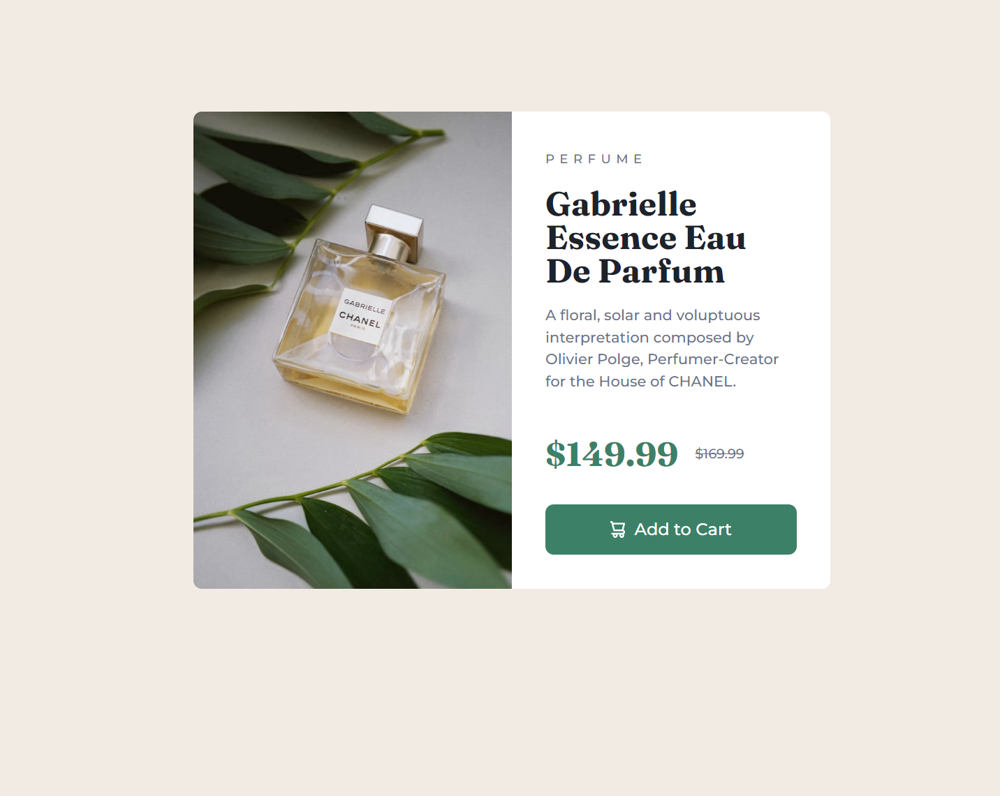

# Frontend Mentor - Product preview card component solution

This is a solution to the [Product preview card component challenge on Frontend Mentor](https://www.frontendmentor.io/challenges/product-preview-card-component-GO7UmttRfa). Frontend Mentor challenges help you improve your coding skills by building realistic projects.

## Table of contents

-   [Overview](#overview)
    -   [The challenge](#the-challenge)
    -   [Screenshot](#screenshot)
    -   [Links](#links)
-   [My process](#my-process)
    -   [Built with](#built-with)
    -   [What I learned](#what-i-learned)
    -   [Useful resources](#useful-resources)
-   [Author](#author)

## Overview

### The challenge

Users should be able to:

-   View the optimal layout depending on their device's screen size
-   See hover and focus states for interactive elements

### Screenshot



### Links

-   [Solution URL](https://www.frontendmentor.io/learning-paths/building-responsive-layouts--z1qCXVqkD/steps/66f99e1b5832c087f2ce2734/challenge/refactor)
-   [Live Site URL](https://waragismynickname.github.io/product-preview-card-component/)

## My process

### Built with

-   Semantic HTML5 markup
-   CSS custom properties
-   Flexbox
-   Mobile-first workflow

**Note: These are just examples. Delete this note and replace the list above with your own choices**

### What I learned

While working, I encountered a problem on mobile devices due to the button sticking when pressed. Fixed the entire line that I checked in the manual that I often use [Doka-guide](https://doka.guide/css/hover/)

To see how you can add code snippets, see below:

```css
@media (any-hover: hover) {
    button:hover {
        background-color: hsl(157, 37%, 14%);
    }
}
```

### Useful resources

-   [Doka-guide](https://doka.guide/css/) - This helped me for XYZ reason. I really liked this pattern and will use it going forward.

## Author

-   Frontend Mentor - [@WaRaGiSmYnIcKnAmE](https://www.frontendmentor.io/profile/WaRaGiSmYnIcKnAmE)
